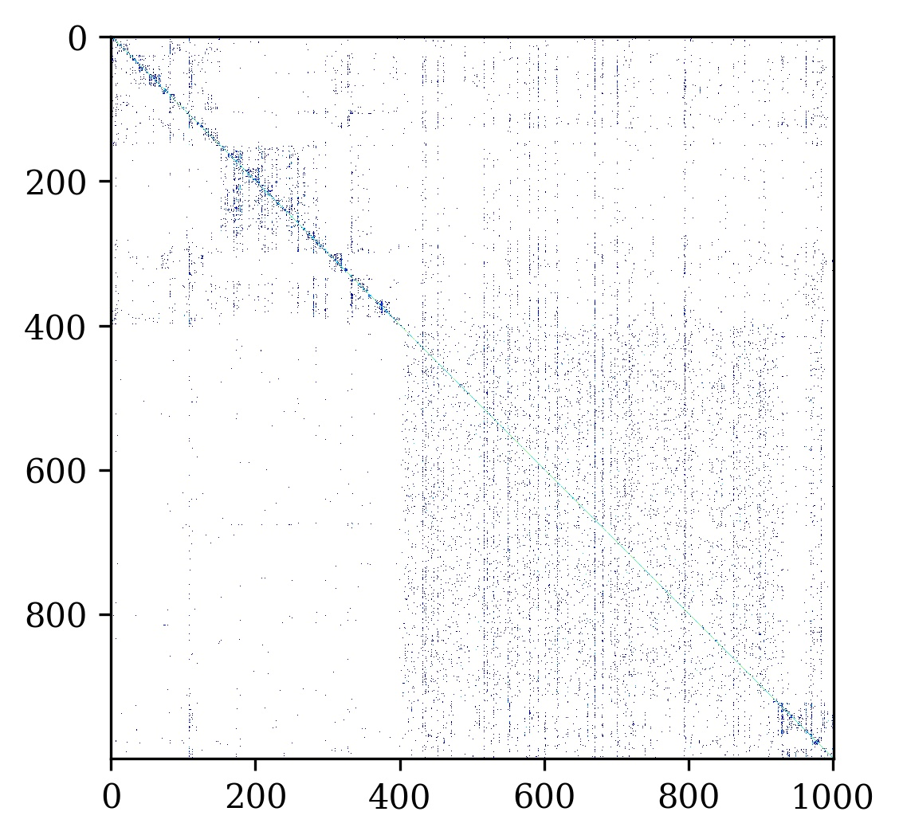
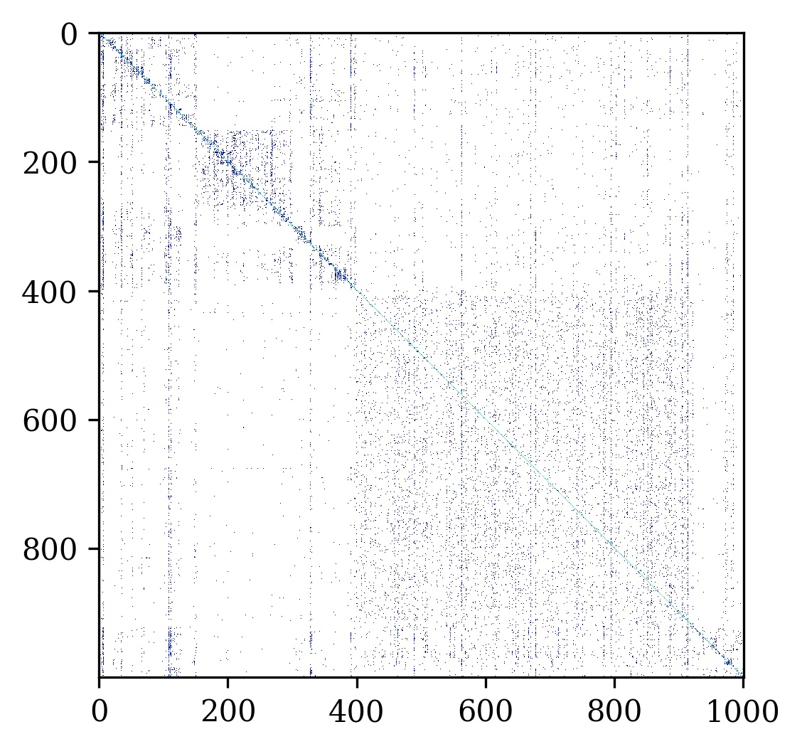

# Can Exposure, Noise and Compression affect Image Recognition?
## An Assessment of the Impacts on State-of-the-art ConvNets

Convolutional Neural Networks stand the current state-of-the-art in image recognition, as well as many computer vision tasks.
Nevertheless, these architectures have been shown to be vulnerable to image manipulations, which may undermine the reliability and safety of CNN-based models in autonomous and robotic applications. We present a rigorous evaluation of the robustness of several high-level image recognition models and investigate their performance under distinct image distortions. We propose a testing framework which emulates ill exposure conditions, low-range image sensors, lossy compression, as well as commonly observed noise types. One one side results measured in terms of accuracy, precision, and F1-Score, indicate that most CNN models are marginally affected by mild miss-exposure, heavy compression, and Poisson noise. Severe miss-exposure, impulse noise, or signal-dependent noise, on the other side, show a substantial drop in accuracy and precision. A careful evaluation of some typical image distortions, commonly observed in computer vision and machine vision pipelines, provides insights and directions for further developments in the field.


This repo contains code and data to reproduce the results shown in: 

``` 
@inproceedings{steffens2019canexposure,
  title={Can Exposure, Noise and Compression affect Image Recognition? An Assessment of the Impacts on State-of-the-art ConvNets},
  author={Cristiano Rafael Steffens, Lucas Ricardo Vieira Messias, Paulo Lilles Jorge Drews-Jr, and Silvia Silva da costa Botelho},
  booktitle={2019 Latin American Robotics Symposium (LARS), 2019 Brazilian Symposium on Robotics (SBR) and 2019 Workshop on Robotics in Education (WRE)},
  pages={6},
  year={2019},
  organization={IEEE}
}
```

All results were obtained using Keras 2.2.4 and Tensorflow 1.14. Image loading, resizing, and colorspace transformations were performed using Scikit-Image. For further details please refer to the presentation [https://www.slideshare.net/steffensbola/can-exposure-noise-and-compression-affect-image-recognition-an-assessment-of-the-impacts-on-stateoftheart-convnets] or to the original paper.

### Example results for distinc miss-exposure and noise conditions (Confusion-matrix 1000 classes)

#### Original


#### Overcompressed


#### Gamma 1/2


#### Gamma 1/4


#### Gamma 1/8



#### Gamma 2


#### Gamma 4


#### Gamma 8


#### Gaussian noise


#### Poisson Noise


#### Saturation (25% of the pixels)


#### Salt and pepper noise



#### Speckle noise


#### Under-exposure (25% of the pixels are 0 in at least one color channel)


